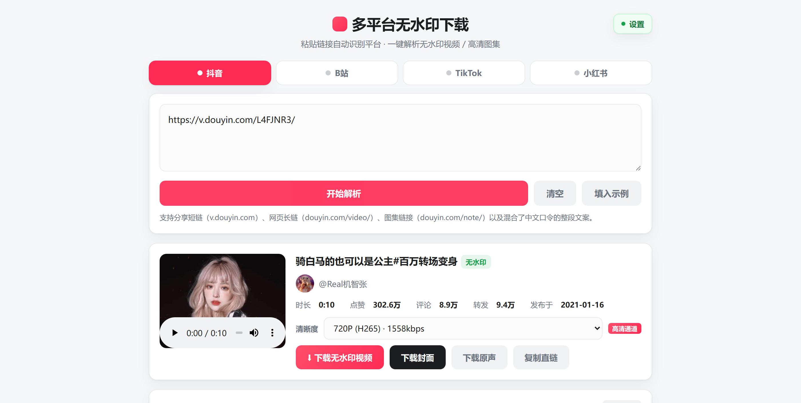
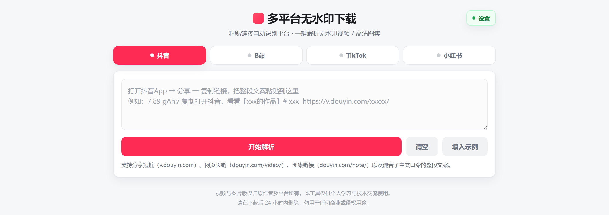
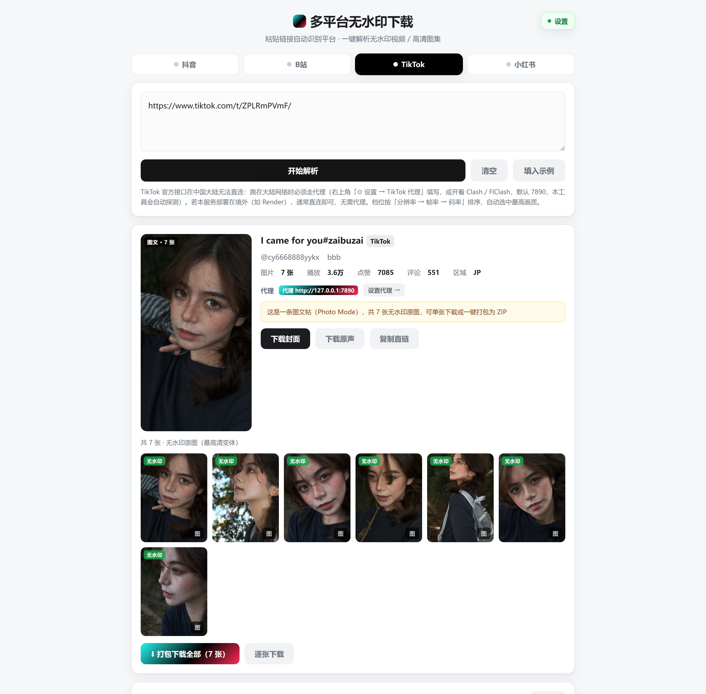
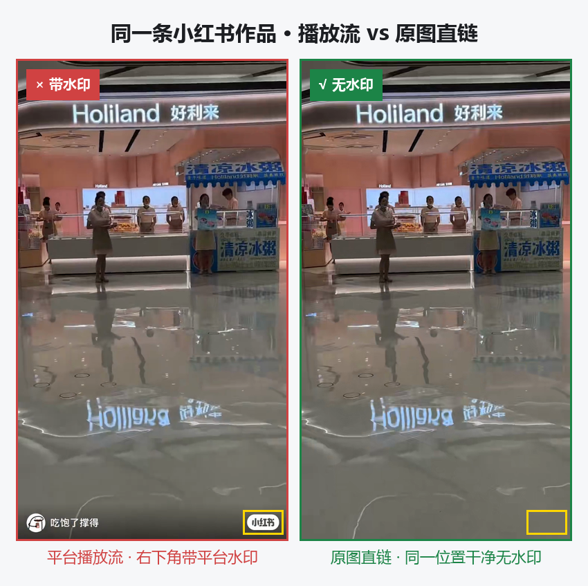

<div align="center">

<h1>多平台无水印下载站</h1>

<b>抖音 · B站 · TikTok · 小红书</b><br>
粘贴链接，一键解析<b>无水印视频</b> / <b>高清图集</b> / <b>动图（实况照片）</b>

**简体中文** | [English](./README.en.md)

<a href="../../releases/latest"></a>
<a href="../../releases"></a>
<a href="../../stargazers"></a>
<a href="../../forks"></a>
<a href="../../issues"></a>

<br>

<a href="#-下载安装"></a>
<a href="#-下载安装"></a>


</div>

---

一个**本地运行**的多平台视频下载工具。把链接粘进输入框，自动识别平台、解析出**无水印**的视频 / 图集 / 动图，支持在线预览与保存到本地。

界面是一个网页，但**服务跑在你自己的电脑或手机上**（`127.0.0.1`），不经过任何第三方服务器 —— 你的链接、下载内容、以及可选的 B站 登录凭据都只留在本机。

> ⚠️ **三个平台各有前提**，请先读 [各平台的前提条件](#️-各平台的前提条件重要)：
> **TikTok 在中国大陆必须自备代理**（不挂代理取不到任何数据）；
> **B站 要「能直接播放的成片」需要 ffmpeg**（Windows 版已内置）；
> **小红书必须用 App 里「分享 → 复制链接」得到的完整链接**。

## 🎬 它长什么样

<div align="center">

<br>
<sub>粘一条抖音链接 → 自动识别平台、选中最高可用档位（720P H.265）、给出下载按钮</sub>
</div>

<br>

<div align="center">

<br>
<sub>初始界面：顶部四个平台可手动切换，也可以直接粘链接让程序自己认</sub>
</div>

<br>

<div align="center">

<br>
<sub>TikTok <b>图文帖（Photo Mode）</b>：整组无水印原图一次列出，可单张下载，也可一键打包成 ZIP</sub>
</div>

**「无水印」是实打实的差别**，不是宣传词。同一条小红书作品，左边是平台的播放流，右边是本工具取到的原图直链 —— 同一个位置（黄框内），左边有平台角标，右边是干净的：

<div align="center">

</div>

<details>
<summary>这张对比图的可复核依据</summary>

两张素材都是 `540×960`。程序化扫描右下角区域（`x 461~524, y 911~941`）的亮像素（RGB 三项均 > 225）：

| 图 | 亮像素数 |
| --- | --- |
| 平台播放流 | **1241** 个（就是那枚「小红书」角标） |
| 本工具直链 | **0** 个 |

原始素材可在仓库历史中查看，扫描脚本是几行 PIL 代码，可自行复现。

</details>

## 📥 下载安装

到 [**Releases**](../../releases/latest) 页面下载。两个包都**自带 Python 运行时**，不用先装环境。

### Windows（推荐）

| | |
| --- | --- |
| 文件 | `multipldl-1.0.8-win64.zip`（≈ 77 MB，解压后 ≈ 166 MB） |
| 依赖 | **零** —— Python 3.13 与 ffmpeg 都已打包在内 |

1. 下载后**解压整个文件夹**（⚠️ 不要只把 `.exe` 单独拖出来，`_internal/` 是它的一部分）
2. 双击 `多平台无水印下载站.exe`
3. 浏览器会自动打开 `http://127.0.0.1:8787`；关掉那个黑色窗口 = 停止服务

> **杀毒软件报毒？** PyInstaller 打包的程序被 360 / 火绒 / 电脑管家误报是常见现象。
> 把整个文件夹加入信任区即可。**不能接受就别用 —— 不要为了跑它去关掉杀毒软件。**

### Android

| | |
| --- | --- |
| 文件 | `multipldl-1.0.8-arm64-v8a-debug.apk`（23.8 MB） |
| 架构 | `arm64-v8a`（2017 年之后绝大多数手机） |
| 签名 | **debug 签名**，安装时需允许「未知来源」；未做 release 签名 |

界面与桌面版完全一致（同一份前端），解析能力也一致。B站 的高清合流在安卓上走系统 `MediaMuxer`，**不依赖 ffmpeg**。

### 从源码运行

```bash
git clone https://github.com/gdSHAY/douyin-wm-downloader.git
cd douyin-wm-downloader
pip install -r requirements.txt
python server.py
```

浏览器打开 `http://127.0.0.1:8787`。（`python server.py --no-browser` 可不让它自动开浏览器。）

如果 8787 被占用，会自动顺延到 8788 等端口，以控制台打印的地址为准。

## ✨ 四个平台各能拿到什么

| 平台 | 视频 | 图集 | 最高清晰度 | 还支持 |
| --- | --- | --- | --- | --- |
| **抖音** | ✅ 无水印 mp4 | ✅ 原图 | 最高 1440P（**受作品本身上限约束**） | 实况照片（静态图 + 动态视频）、封面、多档切换 |
| **B站** | ✅ DASH 合流 mp4 | — | 未登录 480P / 登录后可达 4K | 分 P、音频 MP3、弹幕 XML、封面、本机合流兜底 |
| **TikTok** | ✅ 无水印 mp4 | ✅ 无水印原图 | **最高 4K 60fps** | 图文帖（Photo Mode）整组打包、按分辨率 → 帧率 → 码率自动选档、封面、原声 |
| **小红书** | ✅ 无水印 mp4 | ✅ 高清原图 | 原图 / 原片 | 动图（Live Photo）、打包下载全部 |

顶部横条可手动切平台；直接粘贴链接则由前后端自动识别并联动切换。切换平台会清空输入与结果（避免串台），历史记录按平台分开保存。

## ⚙️ 三步开始用

1. **选平台**（或直接粘链接让它自己认）
2. **粘贴** —— 分享短链、网页长链、或 App 里「复制链接」得到的那一整段带中文的分享文案，都能识别
3. **点「开始解析」** → 预览 → 点下载

**支持的链接形态**

| 平台 | 可接受的写法 |
| --- | --- |
| 抖音 | `https://v.douyin.com/xxxxx/`（短链）、`https://www.douyin.com/video/<id>`、`https://www.douyin.com/note/<id>`、含链接的整段分享文案 |
| B站 | `https://www.bilibili.com/video/BV...`、`https://b23.tv/xxxxx`、含分 P 的 `?p=2` |
| TikTok | `https://www.tiktok.com/@user/video/<id>`、`https://www.tiktok.com/@user/photo/<id>`、短链 `https://www.tiktok.com/t/xxxxx/` 与 `https://vm.tiktok.com/xxxxx/` |
| 小红书 | **必须**是 App「分享 → 复制链接」得到的完整链接（含 `xsec_token`），纯笔记 ID 会被平台拒绝 |

## ⚠️ 各平台的前提条件（重要）

这几条**不是工具的局限，是平台的限制**，逐条都有实测记录。

### TikTok 在中国大陆需要代理

实测：DNS 能解析出 IP，但 TCP 443 超时。**不挂代理取不到任何数据**（不是「慢」或「偶尔失败」，是必然失败）。

点页面右上角「设置 → TikTok 代理」，填本机代理地址（Clash / FlClash 一般是 `http://127.0.0.1:7890`），再点「保存并检测」，看到「可连 TikTok」即可。

> 部署在**境外服务器**上时反之 —— 直连即可，代理留空。

### B站 出「成片」需要 ffmpeg

B站 高清是 **DASH 音视频分离**（视频轨、音频轨是两条独立流）。要交付一个能直接播放的 mp4，必须服务端合流，因此依赖 ffmpeg。

- **Windows 版已内置 ffmpeg**，开箱可用。
- 从源码跑：装好 ffmpeg 并确保在 `PATH` 里；或设环境变量 `FFMPEG_PATH`。
- **找不到 ffmpeg 时不会静默给你一个没声音的文件** —— 界面会降级为「视频轨 / 音频轨分别下载」，并给出合流命令。

### B站 清晰度取决于账号

| 清晰度 | 前提 |
| --- | --- |
| 360P / 480P | 无需登录（**未登录实测上限 = 480P**） |
| 720P / 1080P / 1080P60 / 4K | 需要登录（`SESSDATA`） |

点页面右上角「⚙ 账号设置」，把**导出的 `cookies.txt` 全文**或 `SESSDATA=xxx` 粘进去即可。保存时会先向 B站 校验登录态，通过了才落盘 —— 一份复制不全的 Cookie 不会把原本可用的配置顶掉。

> 🔒 `SESSDATA` 等同于账号登录态。工具只把它用于请求该账号有权观看的清晰度，**不外传、不上传**。
> 网页的设置面板只回传打码值（形如 `3bee…IIEC`）与长度，任何接口都不返回明文。
> 也正因如此，本仓库的 `.gitignore` 明确排除了 `bili_config.json` —— **不要把它提交上来**。

**实测澄清（2026-09）**：用一个会员早已过期的普通登录账号，同一个视频拿到了 `4K / 1080P60 / 1080P / 720P` 共 6 档；同一链接未登录时只有 480P + 360P。所以「4K 必须大会员」这个说法**不成立**。本工具只以 `dash.video` 里**真实存在的轨道**为准，不信 `vipStatus` 字段。

### 小红书必须带 `xsec_token`

纯笔记 ID 的链接会被平台拒绝（实测返回「你访问的页面不见了」、内嵌数据为空）。**必须用 App 里「分享 → 复制链接」得到的完整链接。**

### 抖音「为什么没有更高清」

两个原因，按顺序排查：

1. **作品本身的上限。** 抖音竖屏视频大量是 720P，只有部分新作品有 1080P / 2K / 4K。解析结果里的档位来自平台返回的数据，源就是 720p 的话，任何工具都变不出 4K。
2. **取流通道被风控降级。** 抖音有两条取流路径：带签名的**高清通道**（多档可选）和不签名的**降级通道**（只有一档「默认」）。界面上会直接标出你走的是哪条。机房 IP（尤其境外）更容易被降级。

降级通道给出的**仍然是无水印视频**，只是没有档位可选。想知道具体原因，按 `F12` 看 `/api/parse` 响应里的 `hd_error` 字段 —— 后端会如实写明是「接口返回空数据（可能已触发风控）」还是网络超时。

## 🧱 技术栈

| | |
| --- | --- |
| 后端 | Python + [FastAPI](https://fastapi.tiangolo.com/) + Uvicorn（单进程本地服务） |
| 前端 | 单文件原生 HTML / JS，**无构建步骤**，由后端直接渲染注入端口 |
| 网络 | `requests`、`curl_cffi`（小红书需要伪装 TLS 指纹）、`gmssl`（抖音签名） |
| 媒体 | ffmpeg（B站 合流，Windows 版内置） / Android `MediaMuxer` |
| 打包 | PyInstaller（Windows）/ Buildozer + python-for-android（Android，云端构建） |

## 🗂 项目结构

```
server.py              FastAPI 后端：路由、解析编排、下载代理、本机保存
static/index.html      前端界面（单文件，无构建）
douyin_parser.py       抖音解析（含风控降级判定）
douyin_hd.py           抖音高清通道：档位选择
douyin_abogus.py       抖音 a_bogus 签名
bili_parser.py         B站 解析（清晰度、分P、弹幕）
dash_muxer.py          B站 DASH 合流（调 ffmpeg）
tiktok_parser.py       TikTok 解析（视频多档 + 图文帖 + 直链换链重试）
xhs_parser.py          小红书解析（原图 / 动图）
disk_saver.py          服务端落盘：任务队列、进度、取消
runtime_paths.py       路径工具（区分源码 / exe / APK 三种运行形态）
requirements.txt       依赖清单
使用说明.txt            随压缩包分发的快速上手说明
docs/                  README 用的截图
```

## 🔌 REST API

界面不是必须的 —— 服务本身就是一套 HTTP 接口，`python server.py` 之后可以直接调。

| 方法 | 路径 | 作用 |
| --- | --- | --- |
| `POST` | `/api/parse` | 解析链接，返回标题、封面、档位、直链 |
| `GET` | `/api/download` | 代理下载（带 Referer / UA，避免 403） |
| `GET` | `/api/bili/tracks` | B站 可用的视频/音频轨与清晰度列表 |
| `GET` | `/api/bili/download` | B站 合流成片（需要 ffmpeg） |
| `GET` | `/api/bili/danmaku` | 弹幕 XML |
| `POST` | `/api/save` | 服务端下载并落盘（带进度） |
| `GET` | `/api/proxy` | 查询当前 TikTok 代理探测结果 |

交互式接口文档：服务起来后打开 `http://127.0.0.1:8787/docs`。

## ❓ 常见问题

<details>
<summary><b>双击后窗口一闪就没了 / 浏览器没反应</b></summary>

不能只把 `.exe` 拖到别处单独运行，**必须和 `_internal/` 文件夹待在一起**。另外看窗口里打印的地址 —— 8787 被占用时会自动顺延到 8788 等端口。
</details>

<details>
<summary><b>B站 下载下来没声音</b></summary>

说明 ffmpeg 没找到，你拿到的是分离的视频轨。用 **Windows 压缩包版**（内置 ffmpeg）即可；源码运行时请装 ffmpeg 或设 `FFMPEG_PATH`。界面上如果提示「视频轨 / 音频轨分别下载」，就是这种情况。
</details>

<details>
<summary><b>TikTok 能解析出来，但每条下载都 403 / 502</b></summary>

看错误文案里的**状态码**和括号内容，它写明了这次是经谁去取的：

- **403 且域名含 `webapp-prime`** → 该媒体主机被 TikTok 边缘节点拒了。新版会自动换同一档位的其它直链；若仍失败，说明当前代理节点被挡，换个节点。
- **502 且域名是 `tiktokcdn-us.com` / `tiktokv.com`** → 域名没问题，是代理软件转发失败。确认它的分流规则覆盖了 TikTok 的 CDN 域名，或临时切「全局」模式。
- **括号里是「直连」** → 代理没生效。回「设置 → TikTok 代理」点「保存并检测」。
</details>

<details>
<summary><b>我填的设置下次打开还在吗</b></summary>

在。设置存在程序同目录的 `data/`（源码运行时是 `bili_config.json` / `tiktok_config.json`），别删。整个文件夹拷到别的电脑，设置也跟着走。
</details>

<details>
<summary><b>下载很慢</b></summary>

最高档可能是几百 MB，属正常。在清晰度下拉里选低一档会快很多。
</details>

## 📄 合规与免责

- 视频与图片的**著作权归原作者及平台所有**。
- 请仅用于**个人学习与技术交流**，不要用于商业或侵权用途；下载内容请在 **24 小时内删除**。
- 擅自下载、传播他人作品可能违反平台服务协议及相关法律法规，**风险由使用者自行承担**。
- 本工具不绕过任何付费内容：能拿到什么清晰度由平台与你的账号权限决定。

## 📮 联系

| | |
| --- | --- |
| 问题反馈 | [Issues](../../issues) |
| 仓库 | <https://github.com/gdSHAY/douyin-wm-downloader> |

## ⭐ Star 历史

<a href="https://star-history.com/#gdSHAY/douyin-wm-downloader&Timeline">
  
</a>

## 📄 许可

本仓库**未附带开源许可证**（All rights reserved）。你可以自由下载与使用发行版；如需在其它项目中复用代码或商用，请先通过 Issues 联系作者。

<div align="center">
<sub>本 README 采用「<a href="./README.en.md">简体中文</a> / English」双语，可用顶部链接切换。</sub>
</div>
